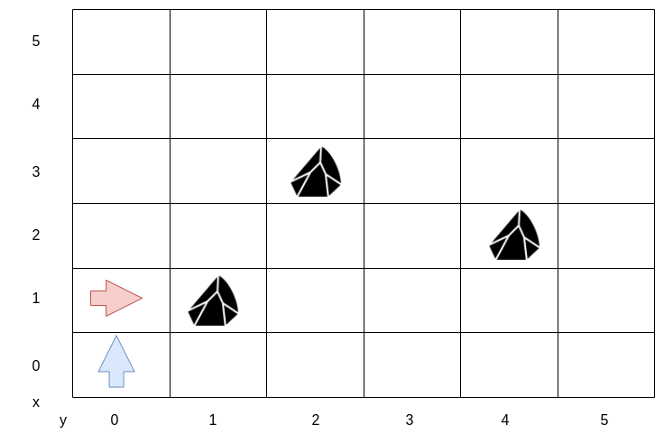
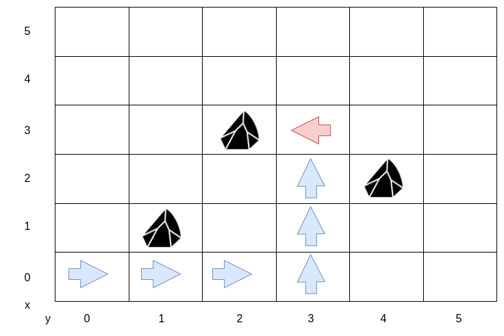
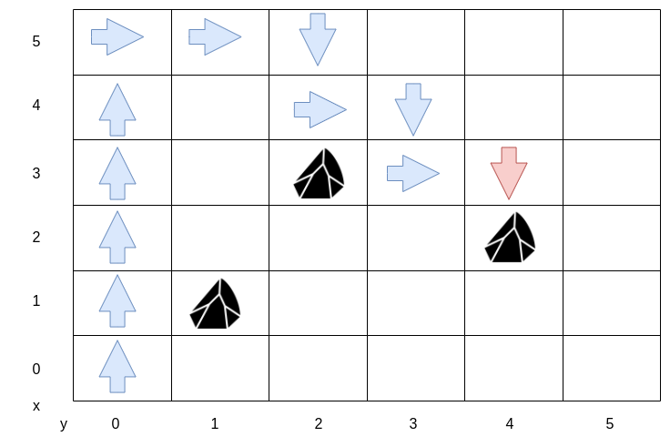

# Mars Rover

A squad of robotic rovers are to be landed by NASA on a plateau on Mars.

This plateau, which is curiously rectangular, must be navigated by the rovers so that their onboard cameras can get a complete view of the surrounding terrain to send back to Earth.

A rover's position is represented by a combination of an `x` and `y` coordinates and a letter representing one of the four cardinal compass points. The plateau is divided up into a grid to simplify navigation. An example position might be `0, 0, N`, which means the rover is in the bottom left corner and facing North.

In order to control a rover, NASA sends a simple string of letters. The possible letters are `L`, `R` and `M`. 
`L` and `R` makes the rover spin 90 degrees left or right respectively, without moving from its current spot.
`M` means move forward one grid point, and maintain the same heading.

Assume that the square directly North from `(x, y)` is `(x, y+1)`.

## 📋 Requirements

Develop an API that moves a rover on a plateau.

### Input:

The first line of input is the upper-right coordinates of the plateau, the lower-left coordinates are assumed to be 0,0.

The rest of the input is information pertaining to the rovers that have been deployed. Each rover has two lines of input. The first line gives the rover's position, and the second line is a series of instructions telling the rover how to explore the plateau.

The position is made up of two integers and a letter separated by spaces, corresponding to the x and y co-ordinates and the rover's orientation.

Each rover will be finished sequentially, which means that the second rover won't start to move until the first one has finished moving.

### Output:

The output for each rover should be its final co-ordinates and heading.

### Example

#### Test Input:
5 5    
1 2 N    
LMLMLMLMM    
3 3 E    
MMRMMRMRRM    

#### Expected Output:
1 3 N    
5 1 E

## Implement obstacle detection
Implement obstacle detection before each move to a new square. If a given sequence of commands encounters an obstacle, the rover moves up to the last possible point, aborts the sequence and reports the obstacle.

### Examples with obstacles

For the examples with obstacles, we will use a plateau whose upper-right coordinate is (5, 5) and has obstacles at positions (1, 1), (2, 3), and (4, 2).

#### Example with obstacles and command string MRMMRMMM
Initial position and orientation: **0 0 N**  
Commands: **MRMMRMMM**  
Final position and orientation: **0 1 E**  


#### Example with obstacles and command string MMMLMMMLMMM
Initial position and orientation: **0 0 E**    
Commands: **MMMLMMMLMMM**  
Final position and orientation: **3 3 W**  


#### Example with obstacles and command string MMMMMMRMMRMLMRMLMRMLMR
Initial position and orientation: **0 0 N**  
Commands: **MMMMMMRMMRMLMRMLMRMLMR**  
Final position and orientation: **4 3 S**  

  

## 📏 Rules

- 🔴 Hardcore TDD. No Excuses!
- 🔁 Change roles (_driver, navigator_) after each TDD cycle.
- ❌ No red phases while refactoring.
- ⚠️ Be careful about edge cases and exceptions. We can not afford to lose a Mars Rover, just because the developers overlooked a 💥 null pointer.
  


## 🗂️ Project Structure

```
mars_rover/
├── src/           # 📘 Sources Root
├── tests/         # 📗 Tests Source Root
├── Pipfile        # 📦 Dependency management file using pipenv
└── README.md      # 📖 Project documentation (you're reading it!)

```

## 🛠 Requirements

- Python 3.10

## 📦 Setup

1. Clone the repository:
   ```bash
   git clone https://github.com/ismail2ov/mars-rover-kata-python
   ```

2. Install dependencies:
   ```bash
   pipenv install --dev
   ```

3. Activate the virtual environment:
   ```bash
   pipenv shell
   ```

## ✅ Run Tests

To run the tests with `pytest`:

```bash
pytest
```

## 🔍 Run Tests with Coverage

To run the tests with `pytest`:

```bash
pytest --cov=src --cov-report=html tests/
```

This will generate a directory called 📂 /[htmlcov](htmlcov) with an 🌐 [index.html](htmlcov/index.html) file that you can open in a browser to view the 📊 coverage report.
